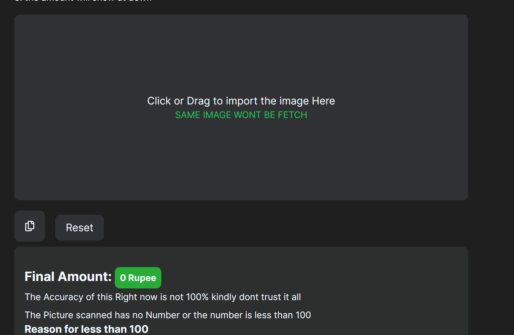

## SumIT
An OCR based tool for Tibetan Winter Business Sellers

## Getting Started

Steps to setup

```bash
bun dev
```
Steps to use:
1. Click a Photo from your noteBook (make sure the Amounts are clear)

2. import the photo by either drag or click

3. the amount will show at down
# Inspiration

This tool is designed specifically for `Tibetan` Winter Business Sellers, aiming to alleviate the cumbersome process of manual calculations from their books. The inspiration for this tool struck me when I witnessed my father spending countless hours grappling with the complexities of calculating `Bhulon and Mar Tsa`, often under considerable stress. Seeing his struggle sparked the idea to develop a solution that `streamlines these calculations`, saving time and reducing the burden for business owners like him with just one simple click.

# Results
1. Example Image of a Seller

2. the website `before` Process

3. the website `During` Process

4. Result `Sum`

## Deploy on Vercel

The easiest way to deploy your Next.js app is to use the [Vercel Platform](https://vercel.com/new?utm_medium=default-template&filter=next.js&utm_source=create-next-app&utm_campaign=create-next-app-readme) from the creators of Next.js.

Check out our [Next.js deployment documentation](https://nextjs.org/docs/deployment) for more details.
